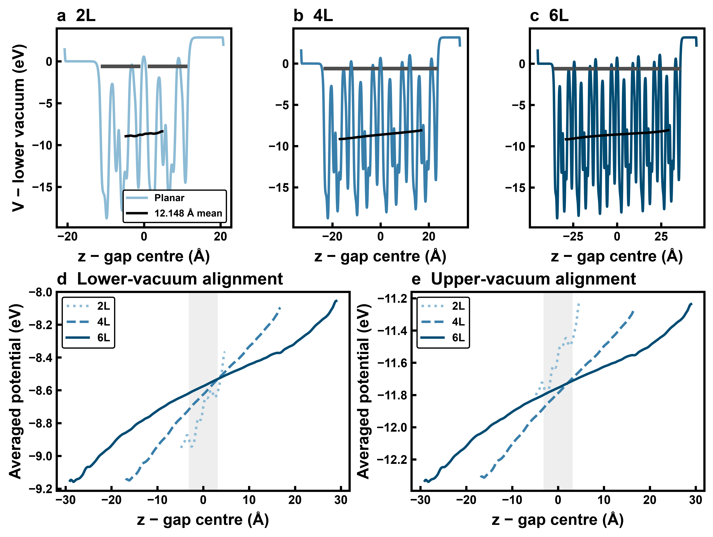

# WP2 Stage 02 — β(001) slab-thickness convergence

Reviewed on 22 September 2026 using the production relaxations in [01_relaxation](../../../calculation/02_numerical_convergence/03_slab_thickness/01_relaxation). The calculation outputs were archived in commit `28aee39`.

**All three accepted relaxations converge electronically and structurally. The 4L→6L comparison meets the predefined project-specific 0.05 eV working tolerance for the measured face-specific work functions and frontier-level diagnostics; 2L→4L does not. Interior electrostatics show partial local agreement but retain appreciable thickness dependence. Surface-excess-energy convergence remains unverified without a matched bulk reference.** Thus 4L is a provisional economical choice for the measured vacuum-referenced diagnostics, not an electrostatically converged interior or an accepted thickness for all surface properties.

## Tolerance provenance

The **0.05 eV criterion was demonstrably predefined**. [ROADMAP §5.6.6, Convergence Acceptance](../../../ROADMAP.md#566-convergence-acceptance) specifies approximately 0.05 eV for relevant vacuum-referenced electronic levels, alongside an energy criterion and qualitative checks. It is present in [commit `2d03597`, lines 371–398](https://github.com/angzeli/znin2s4-computational/blob/2d0359779f329f538951a7d1fefc1dc430e8a3be/vasp/wp2_surface_and_facet_screening/ROADMAP.md#L371-L398), authored and committed on **14 September 2026 at 19:37 +08:00**. The earlier [vacuum analysis](../02_vacuum/VACUUM_ANALYSIS.md), committed as `3ad9305` on 15 September, also applies this target. Both precede completion of J34.1 on 20 September and J36.1 on 21 September (UTC dates from their runtime records).

Accordingly, this report uses **“predefined project-specific working tolerance of 0.05 eV for screening-level electronic descriptors.”** This is an operational accuracy target, not a universal community standard. It was not selected from the observed 0.042153 eV frontier change. The roadmap calls for tighter convergence when resolving smaller mechanistic differences. It does not predefine the interior averaging window or a slope criterion used in the additional analysis below.

## Accepted calculations and common model

| Slab | Job | Accepted output directory | Formula units / atoms | NELM |
| --- | --- | --- | ---: | ---: |
| 2L | J33.1 | [beta001_2L](../../../calculation/02_numerical_convergence/03_slab_thickness/01_relaxation/beta001_2L) | 2 / 14 | 120 |
| 4L | J34.1 | [beta001_4L](../../../calculation/02_numerical_convergence/03_slab_thickness/01_relaxation/beta001_4L) | 4 / 28 | 120 |
| 6L | J36.1 | [beta001_6L/retry_nelm300_r1](../../../calculation/02_numerical_convergence/03_slab_thickness/01_relaxation/beta001_6L/retry_nelm300_r1) | 6 / 42 | 300 |

The files directly under `beta001_6L` are the preserved **failed J35.1 attempt**, which exhausted 120 electronic iterations on the original geometry. Its incomplete outputs are excluded from every endpoint comparison. The parent INCAR still records `NELM=120`; the accepted retry's OUTCAR records `NELM=300`. J36.1 used the same original geometry and a fresh electronic start, changing only this iteration ceiling.

All accepted calculations use VASP 6.6.1, PBE+D3(BJ), 500 eV, Γ-centered 10×10×1 sampling, `PREC=Accurate`, `LREAL=False`, `LASPH=True`, `ISPIN=1`, Gaussian `SIGMA=0.05 eV`, and z-directed dipole correction with `DIPOL=(0.5,0.5,0.5)`. The electronic recipe is `ALGO=Normal`, `AMIN=0.01`, effective `AMIX=0.40`, `BMIX=1.00`, and `EDIFF=10⁻⁶ eV`. Atomic relaxation uses `IBRION=2`, `ISIF=2`, `NSW=100`, and `EDIFFG=−0.02 eV/Å`, without fixed atoms. Resources remain eight MPI ranks × one thread, `NCORE=4`, `KPAR=1`.

The in-plane area is **A = 13.02596521 Ų**. Each seven-atom layer contains one ZnIn₂S₄ formula unit; the starting structures extend the same motif at a 12.14843313 Å repeat spacing, preserve the corresponding lower/upper terminations, and begin with 20 Å vacuum. POTCAR repeats the same S/In_d/Zn datasets to match the existing layer-by-layer species ordering. The two faces are not assumed equivalent.

## Numerical completion and relaxation behavior

OUTCAR contains a genuine EDIFF termination for every force evaluation and an explicit ionic-convergence message for each accepted run. Every terminating electronic cycle has both `|dE|` and `|d eps| < 10⁻⁶ eV`; none exhausts its NELM budget. All final atomic force norms satisfy 0.02 eV/Å. Complete XML and normal OUTCAR timing footers are present, with no identified BRMIX, non-Hermitian, NaN/Inf or serious numerical failures. OUTCAR/XML endpoint energies agree within printed precision, and final CONTCAR coordinates match the evaluated XML geometry within 10⁻⁶ Å.

| Quantity | 2L | 4L | 6L |
| --- | ---: | ---: | ---: |
| Ionic evaluations / converged SCFs | 33 / 33 | 14 / 14 | 16 / 16 |
| First SCF iterations | 31 | 75 | 215 |
| Subsequent SCF range; median | 4–20; 7 | 4–19; 6 | 4–16; 7 |
| Total electronic iterations | 257 | 169 | 324 |
| VASP elapsed time | 1 h 17 min 10 s | 3 h 29 min 28 s | 15 h 54 min 14 s |
| Initial maximum force (eV/Å) | 0.372698 | 0.358748 | 0.356966 |
| Final maximum force (eV/Å) | **0.013555** | **0.018025** | **0.015962** |
| Largest single ionic displacement (Å) | 0.023573 | 0.017307 | 0.017222 |
| Final slab thickness (Å) | 21.734740 | 45.925536 | 70.236201 |
| Final atom-free vacuum gap (Å) | 19.833551 | 19.939621 | 19.925823 |

Displacements use minimum-image distances. Each trajectory has intermittent force rebounds but decreasing free energy at every evaluated geometry. The 2L run needs more ionic evaluations and has several late force excursions; 4L and 6L reach their force criteria in fewer steps. The final three maximum forces are 0.03075→0.02717→0.01356 eV/Å (2L), 0.03343→0.02879→0.01803 (4L), and 0.02424→0.02876→0.01596 (6L). Monotonic force reduction is neither observed nor required.

The 6L computational cost is dominated by its fresh-start SCF: about 10 h 35 min in electronic loops. After the first geometry change, convergence becomes much cheaper. Increasing NELM enabled completion without changing the mixing model; it did not require 300 iterations at every ionic step. These elapsed times describe the observed runs, not a hardware-independent benchmark.

## Energy scaling with thickness

F is the finite-smearing free energy (`TOTEN`); E_without_entropy is VASP's energy without the entropy term; E₀ is its `energy(sigma→0)` estimate. They are reported separately. The common smearing does not establish convergence with respect to smearing width.

| Endpoint energy | 2L | 4L | 6L |
| --- | ---: | ---: | ---: |
| F (eV/slab cell) | −56.96701880 | −114.45163599 | −171.95807850 |
| E_without_entropy (eV/slab cell) | −56.96444866 | −114.45034546 | −171.95675999 |
| E₀ (eV/slab cell) | −56.96573373 | −114.45099072 | −171.95741924 |
| E₀ / formula unit (eV) | −28.48286687 | −28.61274768 | −28.65956987 |
| Relaxation lowering of F, first to last evaluation (eV/slab cell) | −0.03031903 | −0.01916711 | −0.01708714 |

The more negative total energy of a thicker slab mainly reflects its additional atoms. Even E₀ per formula unit contains a surface contribution that is diluted as thickness increases; its 4L→6L change of −46.822 meV/formula unit is not a surface-convergence criterion.

A useful reference-free diagnostic is the energy per **added** formula unit:

`ε₂→₄ = (E₀,₄ − E₀,₂)/2`, and `ε₄→₆ = (E₀,₆ − E₀,₄)/2`.

| Diagnostic | Value |
| --- | ---: |
| ε₂→₄ | −28.74262850 eV/formula unit |
| ε₄→₆ | −28.75321426 eV/formula unit |
| Change in incremental energy | −10.585765 meV/formula unit |
| Curvature C = E₀,₆ − 2E₀,₄ + E₀,₂ | −21.171530 meV/slab cell |
| C/A | −1.625333 meV/Ų |

The energies are approximately extensive but retain measurable curvature over 2L–6L. The same diagnostic gives −1.675524 meV/Ų using F and −1.575141 meV/Ų using E_without_entropy; the interpretation is not an artifact of choosing E₀.

For this stoichiometric series, the paired surface excess is

`Γ_pair(N) = [E₀,N − N e_bulk]/A`.

Consequently, `ΔΓ_pair = [ΔE₀ − ΔN e_bulk]/A`. Unlike the fixed-composition vacuum comparison, **the bulk term does not cancel** when changing thickness. This directory contains no matched bulk reference, so the [roadmap's](../../../ROADMAP.md) 1 meV/Ų criterion cannot be independently evaluated here. C/A measures the difference between successive Γ_pair increments; it is not either increment itself and is not an automatic pass/fail test against that tolerance.

A three-point linear fit gives a slope of −28.74792138 eV/formula unit. Using that fitted slope as the bulk reference would produce apparent adjacent Γ_pair changes of only ±0.812666 meV/Ų, but the reference was determined from those same three points. That is a fit-consistency diagnostic, not independent evidence that the series is asymptotic. Slab-energy fitting can be useful when its thickness range is demonstrated to be adequate ([Fiorentini and Methfessel](https://arxiv.org/abs/cond-mat/9610046)); no absolute surface energy or separate individual-face energies are assigned here.

## Vacuum-referenced electronic convergence

The face-specific diagnostic is `Φ = V_vac − E_F`, using the same-run Hartree-plus-ionic LOCPOT (`LVHAR`), following [VASP's work-function guidance](https://vasp.at/wiki/Computing_the_Workfunction). Raw potential or Fermi-level offsets from different cells are not compared directly.

Planar averages were evaluated separately on each side, with a 6 Å setback from the outermost atom and a 1 Å exclusion from the periodic boundary. LOCPOT, CHGCAR and final evaluated geometries agree; native potential/density grids match. The grids are 56×56×640, 56×56×960 and 56×56×1344. Integrated densities reproduce 124/248/372 electrons within 1.7×10⁻⁵ electrons.

All six selected windows pass the existing width, flatness and depleted-density screening: widths ≥2.79 Å, absolute slopes ≤0.000394 eV/Å, detrended residuals ≤0.000126 eV, potential ranges ≤0.001184 eV, and maximum absolute densities ≤1.08×10⁻⁶ e/ų. No potential discontinuity lies within a selected window. Both faces also pass at 5 Å setback; the largest change in the vacuum mean between 5 and 6 Å is 0.000254 eV. The closer 2 Å windows fail density/flatness checks and were not used.

| Quantity (eV) | 2L | 4L | 6L |
| --- | ---: | ---: | ---: |
| Lower-face Φ | 3.983900 | 3.767710 | 3.767954 |
| Upper-face Φ | 6.833582 | 6.930883 | 6.948772 |
| Upper-minus-lower vacuum step | 2.849682 | 3.163173 | 3.180818 |

| Refinement | ΔΦ lower (eV) | ΔΦ upper (eV) | 0.05 eV working tolerance |
| --- | ---: | ---: | --- |
| 2L→4L | −0.216190 | +0.097301 | **Not met on either face** |
| 4L→6L | +0.000244 | +0.017889 | **Met on both faces** |

The two faces retain substantially different vacuum references and should not be averaged. Flat distant-vacuum regions support the alignment, but do not independently prove negligible periodic-image energy effects at these thicker geometries.

EIGENVAL gives the following frontier diagnostic, using band index `b = NELECT/2` and `Δ_frontier = min_k ε(b+1,k) − max_k ε(b,k)`:

| Diagnostic | 2L | 4L | 6L |
| --- | ---: | ---: | ---: |
| Band indices b / b+1 | 62 / 63 | 124 / 125 | 186 / 187 |
| Δ_frontier (eV) | −0.146226 | +0.028068 | +0.044340 |
| Band-b maximum relative to lower vacuum (eV) | −3.821925 | −3.758227 | −3.782734 |
| Band-b maximum relative to upper vacuum (eV) | −6.671607 | −6.921399 | −6.963553 |
| Band-(b+1) minimum relative to lower vacuum (eV) | −3.968151 | −3.730159 | −3.738394 |
| Band-(b+1) minimum relative to upper vacuum (eV) | −6.817833 | −6.893331 | −6.919213 |

The largest 4L→6L change among these four aligned extrema is **0.042153 eV**, within 0.05 eV. EIGENVAL/XML arrays agree within their printed precision, and weighted occupations reproduce NELECT within 10⁻⁶ electrons. Partial occupations remain in all three runs; the small positive frontier separations in 4L/6L are below the 0.05 eV smearing width. They are not evidence of a validated bulk-like semiconductor gap. No layer-resolved state localization or bulk-edge assignment is made.

## Slab-interior electrostatic consistency

### Method and structural registration

This analysis uses only the accepted J33.1/J34.1/J36.1 endpoint LOCPOT, CHGCAR, CONTCAR and XML files listed above. All three potentials are **LVHAR Hartree-plus-ionic potentials**, in eV. The volumetric-file headers match the final evaluated structures within their six-decimal printing precision; charge and potential grids coincide. Native planar profiles are `V̄(z) = mean_xy V(x,y,z)`, with `z_j = j h/N_z` along the perpendicular cell height h. Periodic interpolation includes the last-grid-point-to-first-point interval.

The layer-by-layer atom ordering identifies the seven-plane S₄In₂Zn units. Layers are numbered from lower to upper z. The most interior pair is layers 2/3 in 4L and 3/4 in 6L; both layers in 2L remain surface-adjacent. The outermost-atom midpoint defines the slab centre, whereas the midpoint **g** of the central interlayer gap registers comparable local environments. These are slightly different; mirror symmetry is not imposed.

| Slab | Slab centre z (Å) | Central-gap midpoint g (Å) | Central neighboring layers |
| --- | ---: | ---: | --- |
| 2L | 20.758648 | 20.761646 | 1 / 2 |
| 4L | 32.911762 | 32.921823 | 2 / 3 |
| 6L | 45.061230 | 45.075571 | 3 / 4 |

To suppress atomic-scale oscillations, a box average uses the **original structural repeat L = 12.1484331333 Å**, independently checked against the starting geometry, fixed for all thicknesses:

`V_M(z) = (1/L) ∫[z−L/2,z+L/2] V̄(s) ds`.

The integral is exact for a periodic piecewise-linear interpolation of the native planar grid. No fitted slope is removed and no vertical shift is fitted to make profiles coincide. Each profile is separately aligned as `V_M − V_vac,lower` and `V_M − V_vac,upper`, using the same distant-vacuum windows as above. The two references are never averaged.

The common comparison window is **u = z−g ∈ [−L/4,+L/4]**, width **6.074217 Å**. Its full averaging footprint lies inside every slab's atomic envelope, including 2L. Means and RMS differences use trapezoidal integration over 2001 common u points; slopes are least-squares fits and ranges are maximum minus minimum. The figure displays the smoothed profile only where the full averaging box lies inside the slab. This fixed-repeat smoothing is an interpretive aid: relaxation leaves some motif-scale variation, and a finite-window mean is not a unique bulk potential.

*Top: native planar potentials and repeat averages, each relative to its lower vacuum; grey bars mark relaxed layer envelopes. Bottom: repeat averages using lower- and upper-vacuum alignment separately; grey shading marks the common central comparison window. The vacuum discontinuity is outside the interior analysis. [Vector PDF](SLAB_INTERIOR_ELECTROSTATICS.pdf).*

### Central profiles and thickness dependence

| Central-window descriptor | 2L | 4L | 6L |
| --- | ---: | ---: | ---: |
| Mean relative to lower vacuum (eV) | −8.738397 | −8.624581 | −8.574700 |
| Mean relative to upper vacuum (eV) | −11.588079 | −11.787754 | −11.755518 |
| Residual slope (eV/Å) | +0.063051 | +0.029048 | +0.013620 |
| Potential range (eV) | 0.345784 | 0.178816 | 0.083573 |

| Refinement / vacuum reference | Change in central mean (eV) | Maximum pointwise difference (eV) | RMS profile difference (eV) |
| --- | ---: | ---: | ---: |
| 2L→4L / lower | +0.113815 | 0.246998 | 0.134988 |
| 2L→4L / upper | −0.199675 | 0.291993 | 0.212457 |
| 4L→6L / lower | +0.049881 | 0.097462 | 0.056747 |
| 4L→6L / upper | +0.032236 | 0.079816 | 0.042086 |

All differences use unrounded data. The 4L→6L central means differ by less than 0.05 eV under both alignments, but the lower-aligned value is only marginally below it. **That comparison alone is insufficient to establish interior convergence.** The full central profiles differ more, and both slope and range fall by roughly half between 4L and 6L. Their remaining thickness dependence is present under either vacuum alignment; additive gauge shifts cannot remove a slope or range difference. The 0.05 eV screening target is not promoted to a separately validated pass/fail rule for these new interior descriptors.

The 6L slab offers a broader region away from the surfaces and a flatter central profile than 4L, **but not a broad, flat bulk-like plateau**. At its three innermost interlayer-gap centres, the lower-aligned repeat averages are −8.766896, −8.575198 and −8.419976 eV: a **0.346920 eV** variation across **24.297451 Å**. These values sample equivalent structural phases, so the slow variation cannot be dismissed simply as raw ionic-core oscillations. The analysis does not establish its microscopic cause or an asymptotic bulk field.

As a complementary local check, the raw planar potential and density were averaged over the **inner half of the central interlayer gap**, excluding the outer quarters nearest the bounding atomic planes. This uses interstitial regions rather than point values at ionic cores. CHGCAR is divided by cell volume to give e/ų.

| Central interlayer descriptor | 2L | 4L | 6L |
| --- | ---: | ---: | ---: |
| Mean potential relative to lower vacuum (eV) | −0.456587 | −0.401007 | −0.358145 |
| Mean potential relative to upper vacuum (eV) | −3.306269 | −3.564180 | −3.538963 |
| Mean density (e/ų) | 0.098655 | 0.106420 | 0.107312 |

The local potential changes by +0.042862/+0.025216 eV for lower/upper alignment from 4L to 6L. The corresponding density changes by **0.838%**, compared with **7.871%** from 2L to 4L. These observations support local interlayer similarity, alongside the structural gaps below. They do not demonstrate convergence of the full charge distribution, layer-resolved states or band edges.

**Assessment: partial support for local interior similarity; insufficient support for a converged slab-interior electrostatic profile.** In particular, 6L should not be described as having established a bulk-like plateau, and 4L should not be called electrostatically converged merely because its work functions meet the screening tolerance.

The [reproduction helper](../../../script/wp2/analyse_slab_interior.py) exports [native-grid planar potentials, repeat averages and densities](SLAB_INTERIOR_PROFILES.csv), together with both vacuum references and an interior-validity flag. Absolute CSV potentials require subtraction of the stated same-run reference before cross-slab comparison. The helper cross-checks planar means, endpoint geometry, periodic averaging, electron counts and units; every central-window average is independently recomputed by explicit trapezoidal integration through the native knots. `--check-only` performs these checks without exporting files. No native calculation file is written.

## Structural consistency and conclusion

All trajectories retain finite geometries without obvious collapse or overlap; the shortest interatomic distances encountered are approximately 2.287, 2.294 and 2.296 Å for 2L/4L/6L. The final gaps between neighboring seven-plane layers are:

- **2L:** 2.84147 Å.
- **4L:** 2.75884, 2.75757, 2.75228 Å.
- **6L:** 2.75611, 2.74911, 2.74527, 2.74368, 2.74832 Å.

The single gap in 2L remains distinctly wider. Outer gaps agree much more closely between 4L and 6L, while the central gap changes by about 0.0123 Å. This supports improving geometric consistency but does not by itself establish a bulk-like electronic interior. Because ISIF=2 fixes the cell, relaxation changes the actual vacuum slightly; the series therefore measures fully relaxed thickness dependence at a common initial 20 Å separation, rather than at exactly identical final vacuum widths.

**Decision:** retain all three converged endpoints and exclude J35.1 from scientific comparisons. Use 4L provisionally for screening the **measured face-specific work functions, vacuum-step and aligned frontier-state diagnostics** at the predefined project tolerance; 2L is insufficient for those quantities. Relaxed interlayer geometry and local interstitial density show improving consistency, but neither constitutes formal convergence of all structural or electronic properties.

The new interior check narrows this recommendation: **4L remains an economical model for those supported observables, not a validated bulk-like interior.** The appreciable residual profile/slope differences preclude a broad claim of electrostatic thickness convergence. Quantities sensitive to the full interior potential require their own validation.

Surface excess energies still need an independently matched bulk reference; a true bulk-like semiconductor gap and rigorous VBM/CBM assignment remain unvalidated. Adsorption energies, reaction energetics and interface/cocatalyst models have not been thickness-tested here. Before accepting a production thickness for surface energetics, evaluate Γ_pair and complete endpoint force/electronic consistency checks. The independent tighter audit from the earlier setup-validation campaign does not automatically validate these new endpoints. No further calculations were launched for this analysis.
